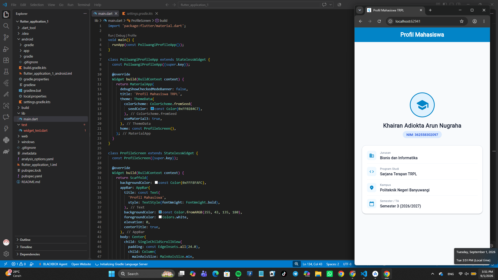

# flutter_application_1

A new Flutter project.

## Getting Started

This project is a starting point for a Flutter application.

A few resources to get you started if this is your first Flutter project:

- [Lab: Write your first Flutter app](https://docs.flutter.dev/get-started/codelab)
- [Cookbook: Useful Flutter samples](https://docs.flutter.dev/cookbook)

For help getting started with Flutter development, view the
[online documentation](https://docs.flutter.dev/), which offers tutorials,
samples, guidance on mobile development, and a full API reference.

# Laporan Praktikum Modul 01: Mobile Ecosystem, Flutter Setup & Profile App

- **Nama**: [Khairan Adiokta Arun Nugraha]
- **NIM**: [362558302097]
- **Kelas / Prodi**: 2C / Sarjana Terapan TRPL
- **Mata Kuliah**: Pemrograman Perangkat Bergerak (Semester 3)

---

## 1. Ringkasan Aktivitas
[menginstal flutter dan menjalankan flutter menggunakan perangkat fisik. dikarenakan belum bisa menampilkan atau tidak bisa sync, maka menggunakan web browser.]

## 2. Bukti Tangkapan Layar (Running App)
[Sertakan minimal 2 screenshot bukti aplikasi profil berjalan di emulator atau HP fisik Anda]

## 3. Kendala yang Dihadapi & Solusinya
- **Kendala**: [Tidak dapat menampilkan aplikasi di hp pribadi menggunakan kabel usb]
- **Solusi**: [Langsung membukanya menggunakan browser]

## 4. Jawaban Pertanyaan Refleksi
1. **Pilihan Native vs Flutter**: [Pengembangan Native digunakan jika aplikasi membutuhkan performa maksimal dan akses mendalam ke perangkat keras keras spesifik (seperti sensor atau kamera tingkat lanjut). Sebaliknya, Flutter dipilih untuk mempercepat waktu pengembangan, karena memungkinkan pembuatan aplikasi iOS dan Android sekaligus hanya dengan satu basis kode (cross-platform) dan memberikan hasil UI yang konsisten.]
2. **Prinsip UI = f(state)**: [Prinsip ini berarti Antarmuka Pengguna (UI) adalah cerminan langsung (fungsi) dari keadaan data aplikasi saat itu (state). Alih-alih mengubah elemen UI secara manual satu per satu saat ada interaksi, Anda cukup memperbarui data (state)-nya, dan UI akan secara otomatis dibangun ulang (rebuild) untuk menyesuaikan dengan data terbaru.]
3. **Pentingnya Conventional Commits**: [Penulisan commit yang terstruktur (seperti feat:, fix:, chore:) sangat penting untuk menjaga riwayat proyek tetap rapi dan mudah dibaca. Ini membantu anggota tim lain memahami sekilas apa tujuan dari perubahan kode tersebut dan sangat berguna untuk menghasilkan catatan pembaruan (changelog) secara otomatis.]