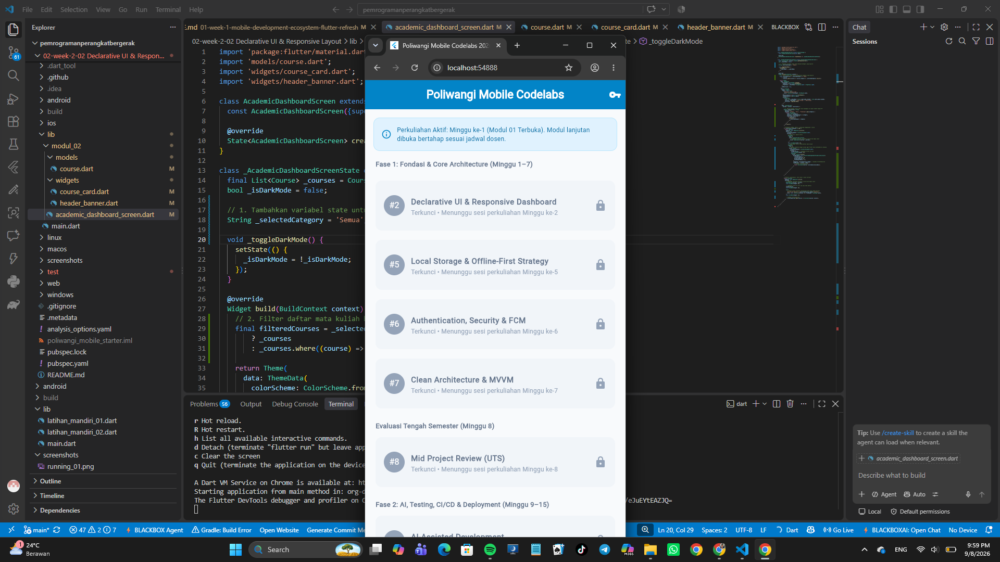
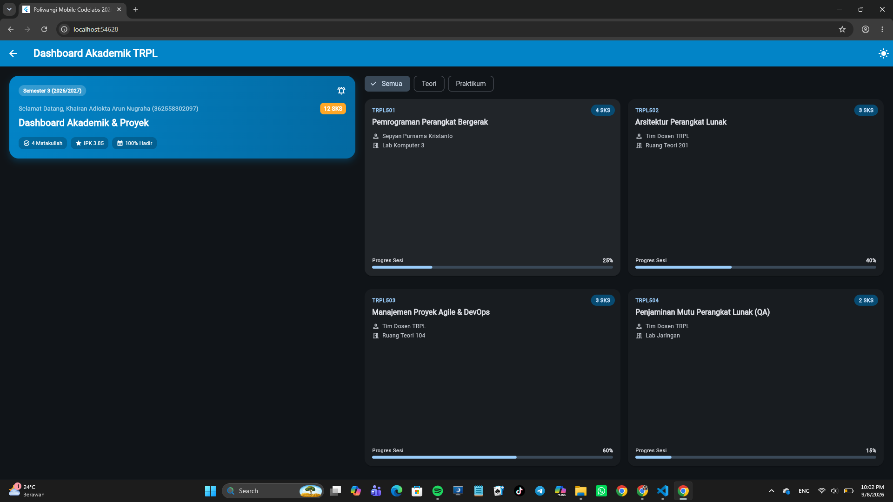
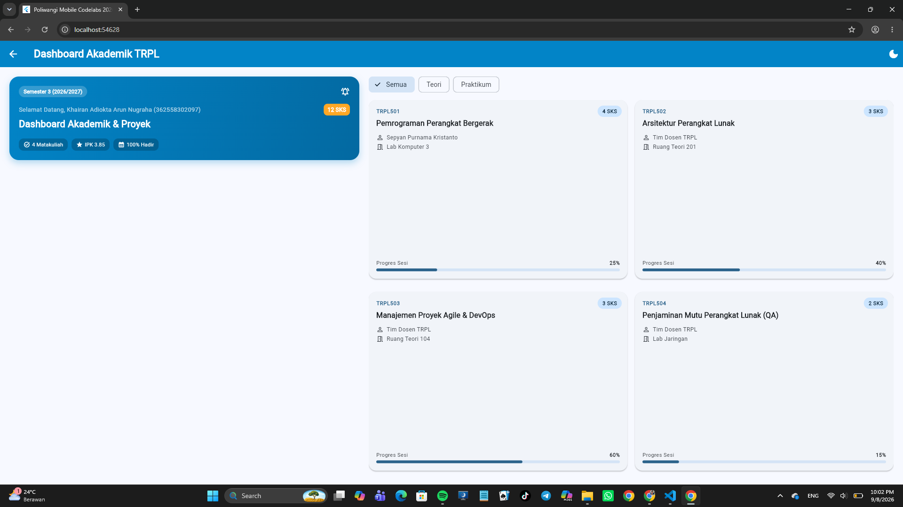

# Laporan Praktikum Modul 02: Declarative UI & Responsive Layout

- **Nama**: Khairan Adiokta Arun Nugraha
- **NIM**: 362558302097
- **Kelas / Prodi**: 2C / Sarjana Terapan TRPL
- **Mata Kuliah**: Pemrograman Perangkat Bergerak (Semester 3)

---

## 1. Ringkasan Implementasi
[Membaca modul dan menggunakan ai untuk trouble shooting. karena ketika saya mengimplementasikan langsung materi yang ada dalam modul, pasti akann bertemu error dan sangat susah untuk fixing nya.]

## 2. Bukti Tangkapan Layar (Running App)
| Mode Portrait (Light) | Mode Dark Theme | Mode Landscape / Tablet (2 Kolom) |
|---|---|---|
|  |  |  |

## 3. Kendala Layout yang Dihadapi & Solusinya
- **Kendala**: Saat layar diputar menjadi mode landscape atau dijalankan di ukuran tablet, tampilan card mata kuliah memanjang atau merenggang tidak proporsional dari ujung kiri ke kanan layar.
- **Solusi**: Menggunakan LayoutBuilder atau MediaQuery untuk mendeteksi lebar layar (misalnya jika maxWidth > 600). Jika layar lebar, saya mengubah layout yang awalnya menggunakan list satu baris menjadi sistem grid (seperti GridView.builder dengan crossAxisCount: 2) agar layar terbagi rapi menjadi dua kolom.

## 4. Jawaban Pertanyaan Refleksi

1. **Efisiensi Single-pass BoxConstraints**: 
   Aturan *"Constraints go down, Sizes go up, Parent sets position"* membuat proses komputasi layout sangat efisien karena menciptakan aliran informasi satu arah. Induk (*parent*) memberikan batasan ukuran maksimal dan minimal (*constraints*) ke anak (*child*), anak menentukan ukurannya sendiri berdasarkan batasan tersebut dan melapor kembali ke induk, lalu induk mengatur koordinat posisi anak. Karena alurnya jelas dan terprediksi, Flutter hanya perlu menyisir pohon widget tepat satu kali (*single-pass rendering*). Hal ini menghasilkan kompleksitas waktu linear atau O(N), yang menghindari penghitungan ulang tata letak berkali-kali.

2. **Kriteria Modularisasi Widget**: 
   Sebuah widget sebaiknya dipecah menjadi **file terpisah** (seperti `CourseCard`) jika widget tersebut *reusable* (digunakan berulang kali di berbagai halaman) atau jika logikanya sudah sangat panjang sehingga membebani file utama (*separation of concerns*). Sebaliknya, widget cukup diletakkan sebagai **private widget** di file yang sama (misal `_NamaWidget`) jika widget tersebut hanya digunakan secara eksklusif di halaman itu saja. Hal ini dilakukan murni untuk memecah method `build()` agar tidak terlalu menjorok ke dalam (*nested*) dan kode lebih mudah dibaca.

3. **Manfaat M3 ThemeData Terpusat**: 
   Penggunaan tema terpusat (ThemeData M3) mempermudah pemeliharaan karena menerapkan prinsip DRY (*Don't Repeat Yourself*). Daripada melakukan *hardcode* warna atau gaya teks secara manual di setiap widget, kita mendefinisikannya di satu tempat (konfigurasi tema utama). Jika di masa depan ada perubahan *branding* warna atau penambahan fitur *Dark Mode*, kita cukup mengubah satu file tema saja, dan seluruh tampilan aplikasi akan otomatis diperbarui secara konsisten tanpa ada warna yang terlewat.